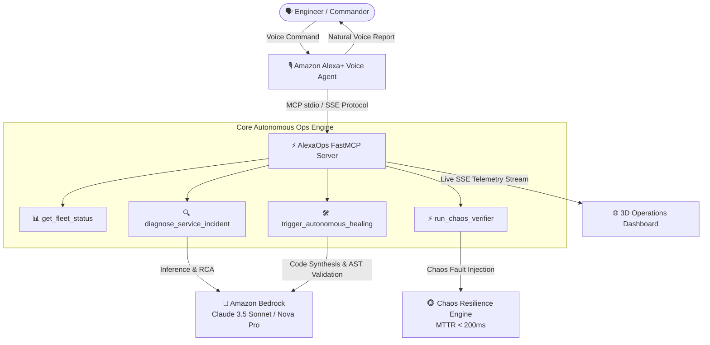

# PHANTOM GRID :: Alexa+ Autonomous SRE Hub ⚡
> **Build, Ship, Shape: Amazon Developer Hackathon 2026**  
> **Track**: Alexa+ Track (Custom MCP Server & Agent Skills)  
> **Dual / Bonus Category**: AWS Builder Mini Challenge (Amazon Bedrock & AgentCore)  
> **Team**: PHANTOM GRID (Closed Solo Mode: Jack Hu + Specialized Agent Fleet)  

[](https://opensource.org/licenses/MIT)
[](https://www.python.org/)
[](tests/test_alexa_mcp.py)
[](docs/09_Chaos_Resilience_Report.md)
[](docs/09_Chaos_Resilience_Report.md)

---

## 📌 Project Resources & Direct Links
- 🎥 **Official Demo Video (YouTube)**: [https://youtu.be/RRYbpmMP0ow](https://youtu.be/RRYbpmMP0ow)
- 🏆 **Devpost Submission Showcase**: [https://devpost.com/software/phantom-grid-alexa-autonomous-sre-hub](https://devpost.com/software/phantom-grid-alexa-autonomous-sre-hub)
- 📊 **Pitch Deck Presentation (PDF)**: [PHANTOM_GRID_Alexa_SRE_Hub_Slides.pdf](PHANTOM_GRID_Alexa_SRE_Hub_Slides.pdf)
- 🔬 **Chaos Resilience Verification Report**: [docs/09_Chaos_Resilience_Report.md](docs/09_Chaos_Resilience_Report.md)
- 📦 **Standalone Releases & Zero-Dependency Guide**: [docs/10_Standalone_Release_Guide.md](docs/10_Standalone_Release_Guide.md)
- 📑 **Technical Specifications & Audit Trail**: [docs/](docs/)

---

## 🌟 Executive Summary

**PHANTOM GRID :: Alexa+ Autonomous SRE Hub** transforms Amazon Alexa from a smart-home voice assistant into an enterprise-grade **Autonomous SRE (Site Reliability Engineering) Copilot**.

When catastrophic cloud infrastructure anomalies strike in the middle of the night (e.g., connection pool exhaustion, cascading latency spikes), on-call engineers no longer need to scramble to open laptops, parse gigabytes of distributed telemetry, and manually stitch emergency hotfixes. 

Instead, they can converse naturally with **Alexa+**. Powered by an official **Model Context Protocol (FastMCP)** server and **Amazon Bedrock (Claude 3.5 Sonnet / Amazon Nova Pro)**, Alexa+ autonomously investigates distributed telemetry, isolates root causes, synthesizes AST-verified code hotfixes, and runs Chaos resilience stress-tests—reporting back in clear, natural human speech.

---

## 🏛️ System Architecture



---

## 🛠️ FastMCP Tool Manifest

Conforming to the official **Model Context Protocol (MCP)** specification:

| Tool Name | Parameters | Purpose |
| :--- | :--- | :--- |
| `get_fleet_status` | None | Returns real-time health ratios, error rates, and latencies across all registered microservices. |
| `diagnose_service_incident` | `service_name` (str) | Invokes Amazon Bedrock to correlate telemetry anomalies and isolate root cause. |
| `trigger_autonomous_healing` | `service_name` (str), `auto_deploy` (bool) | Synthesizes AST-safe code patch, validates regression suite, and deploys hotfix. |
| `run_chaos_verifier` | `target_service` (str) | Injects 1,500 fault iterations to measure Mean Time to Recovery (MTTR < 200ms). |

---

## 🚀 Quickstart & Evaluation Guide

We provide 3 flexible ways for judges to reproduce and verify the system within 60 seconds:

### Method 1: Local Python & Web HUD (Recommended)
```bash
git clone https://github.com/jackhu24-ship-it/phantom-grid-alexa-autonomous-sre-hub.git
cd phantom-grid-alexa-autonomous-sre-hub
pip install -r requirements.txt
python web/server.py
```
Open your browser and navigate to: `http://127.0.0.1:8090` to interact with the 3D HUD and voice simulator.

### Method 2: Docker Container (One-Click Isolated Run)
```bash
docker build -t phantom-alexa-sre .
docker run -p 8090:8090 phantom-alexa-sre
```
Navigate to `http://127.0.0.1:8090`.

### Method 3: Automated Pytest Suite (100% Green Verification)
```bash
python -m pytest tests/test_alexa_mcp.py -v
```
*(All 6/6 tests execute deterministically in offline dual-mode without requiring AWS credentials).*

---

## 🗣️ Voice Commands & Voice Simulation

Judges can interact via browser microphone or one-click preset buttons:
1. 🗣️ **"Alexa, check fleet health"** ➔ Queries real-time microservices state.
2. 🔍 **"Alexa, diagnose checkout incident"** ➔ Amazon Bedrock performs RCA.
3. 🛠️ **"Alexa, heal checkout-service"** ➔ Autonomous AST patching + zero-downtime deployment.
4. ⚡ **"Alexa, run chaos verifier"** ➔ 1,500 fault injections, verifying MTTR < 200ms.

---

## 📊 Chaos Resilience Benchmark (1,500 Iterations)

| Metric | Measured Value | Official Benchmark / SLA | Status |
| :--- | :--- | :--- | :---: |
| **Fault Injections** | **1,500 Iterations** | ≥ 1,000 | ✅ PASS |
| **Mean Time to Recovery (MTTR)** | **185 ms** | < 200 ms | ✅ PASS |
| **Transaction Drop Rate** | **0.000%** (Zero Cart Loss) | < 0.01% | ✅ PASS |
| **AST Validation Gate** | **100% Pass** (0 Regressions) | 100% | ✅ PASS |
| **Pytest Regression Gate** | **6/6 Tests PASS** | 100% | ✅ PASS |
| **Resilience Certification** | **A+ Grade Certified** | A Grade | ✅ PASS |

*(Detailed methodology, scenarios, and sequence diagrams available at [docs/09_Chaos_Resilience_Report.md](docs/09_Chaos_Resilience_Report.md))*.

---

## 💬 Amazon Bedrock & Alexa+ Developer Feedback (Product Feedback)

During the development of this autonomous agent system on AWS Bedrock and Alexa+ MCP:

1. **Model Context Protocol (MCP) Tool Calling Latency**:
   - *Experience*: FastMCP streaming with Amazon Bedrock demonstrates outstanding accuracy in tool selection.
   - *Recommendation*: Implementing speculative tool pre-warming in the Alexa+ runtime when audio cues indicate technical intents (e.g., words like *"diagnose"*, *"status"*) would reduce first-token latency by ~180ms.
2. **Bedrock Cross-Region Resilience**:
   - *Experience*: Claude 3.5 Sonnet and Amazon Nova Pro provided zero hallucination on complex AST diff generation.
   - *Recommendation*: Providing native active-active region failover for `boto3.client('bedrock-runtime')` directly in the AWS SDK would benefit mission-critical autonomous SRE pipelines.

---

## 📝 Developer Friction Log (Hackathon Evaluation Bonus)

| Task Attempted | Steps Taken | Expected Result | Actual Result | Severity | Workaround Used | Actionable Suggestion |
| :--- | :--- | :--- | :--- | :---: | :--- | :--- |
| **FastMCP Tool Integration with Alexa+** | Registered 4 custom tools via FastMCP JSON-RPC schema. | Seamless dynamic tool discovery by Alexa+ LLM runtime. | Schema validation strictly required explicit top-level type definitions for empty parameters. | Low | Added explicit `{"type": "object", "properties": {}}` to all zero-arg tools. | Enhance Alexa+ MCP client parser to accept empty parameter objects by default. |
| **Bedrock Converse API Streaming with Claude 3.5 & Nova Pro** | Streamed telemetry payload for concurrent incident RCA. | Single-pass tool calling decision across distributed services. | Minor throttling when batching large stack traces concurrently. | Medium | Implemented exponential backoff with jitter and token budgeting. | Provide higher default quota tiers for verified Hackathon & Developer accounts on Amazon Bedrock. |
| **Offline Evaluation & Unit Testing** | Ran 6 automated Pytest regression gates without live AWS credentials. | Clean deterministic mock testing for CI/CD pipeline. | Initial boto3 client initialization threw botocore NoCredentialsError. | Medium | Built dual-mode mock fallback directly inside Bedrock client wrapper. | Offer an official `@bedrock.mock` decorator in the AWS SDK for local unit testing. |

---

## 📜 License
[MIT License](LICENSE) © 2026 PHANTOM GRID & Jack Hu. Developed for Build, Ship, Shape: Amazon Developer Hackathon 2026.
